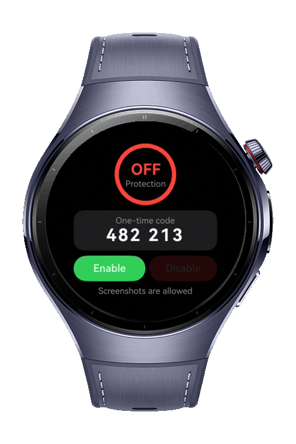
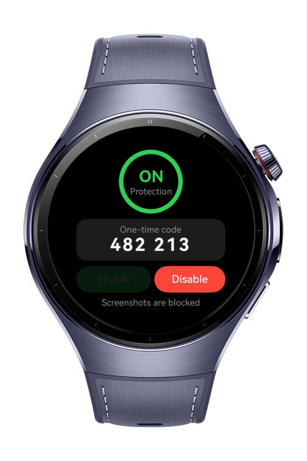
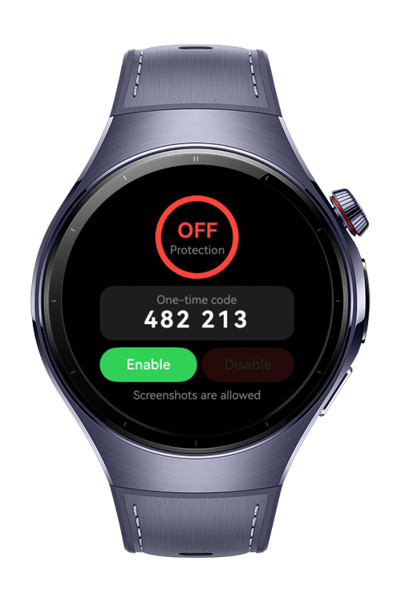

> **Note:** To access all shared projects, get information about environment setup, and view other guides, please visit [Explore-In-HMOS-Wearable Index](https://github.com/Explore-In-HMOS-Wearable/hmos-index).

# How To Implement Screenshot Prevention
This codelab(how-to-implement-screenshot-prevention) shows how to protect sensitive screens on HarmonyOS smart wearables with 'setWindowPrivacyMode'. The demo app lets you enable or disable privacy mode on the app window, reads the actual window state back with 'getWindowProperties()' When protection is on, system screenshots and screen recordings of the window come out black.

# Preview

<div>
    
    
    
</div>

# Use Cases

- Payment and wallet screens: Protect payment QR codes, card details, and transaction confirmations while they are on screen.
- Private health and personal data: Prevent screenshots of screens that show health readings, medical notes, or other personal information.

# Tech Stack

- **Languages**: ArkTS
- **Frameworks**: HarmonyOS SDK 6.1.1(24)
- **Tools**: DevEco Studio Version 6.1.1.280
- **Libraries**: @kit.ArkUI, @kit.AbilityKit, @kit.BasicServicesKit, @kit.PerformanceAnalysisKit

# Directory Structure

```
└── ets
    └── common
        └── constants
            ├── AppConstants.ets
        └── utils
            ├── Logger.ets
    └── components
        ├── ActionButtons.ets
        ├── SensitiveCard.ets
        ├── StatusRing.ets
    └── entryability
        ├── EntryAbility.ets
    └── entrybackupability
        ├── EntryBackupAbility.ets
    └── pages
        ├── Index.ets
    └── services
        └── PrivacyWindowService.ets
```

# Constraints and Restrictions
## Permissions
ohos.permission.PRIVACY_WINDOW

## Supported Devices

- Huawei Watch 5

# License

**How-to-implement-screenshot-prevention** is distributed under the terms of the MIT License
See the [LICENSE](./LICENSE) for more information.